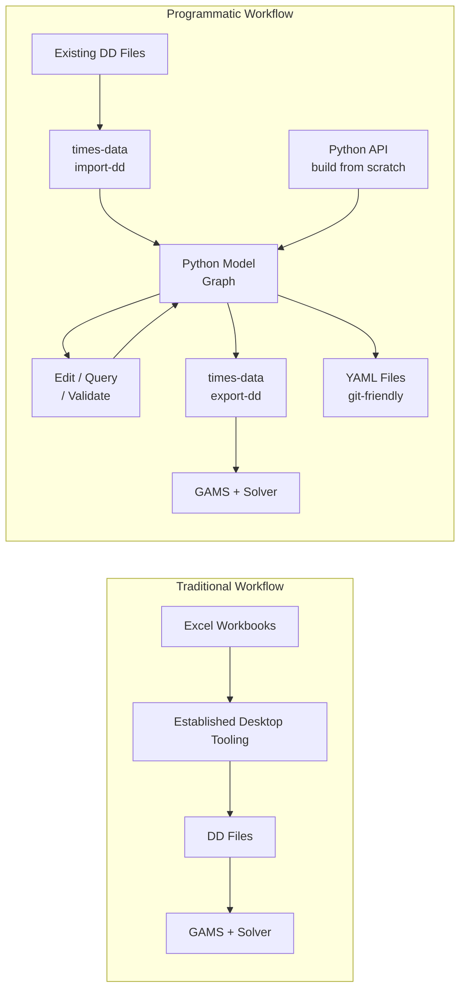
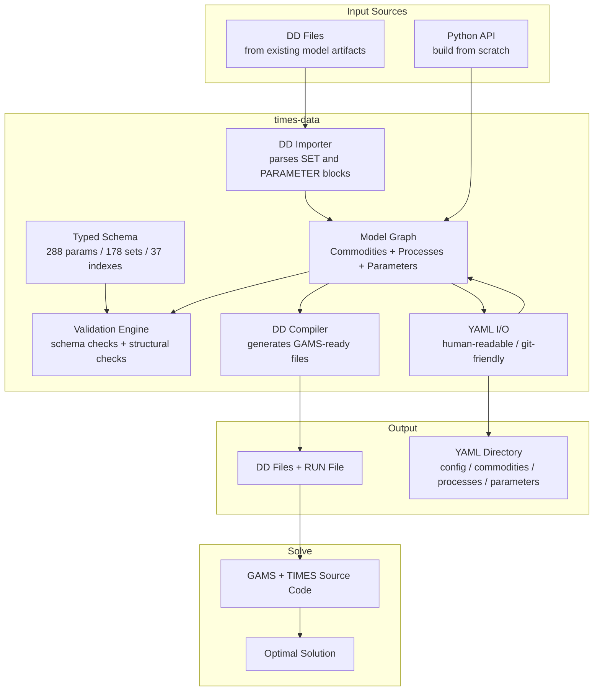
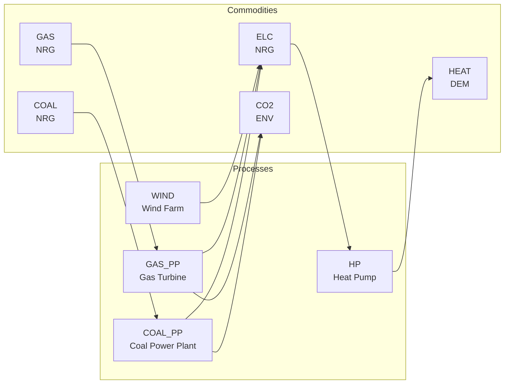

# times-data

An open-source Python library for working with [TIMES](https://iea-etsap.org/) energy system models.

TIMES (The Integrated MARKAL-EFOM System) is the world's most widely used energy system optimization framework. It's maintained by the IEA-ETSAP programme and used by government energy ministries, research institutions, and international organizations in over 70 countries to plan energy transitions, analyze climate policy, and design least-cost decarbonization pathways.

Building a TIMES model often involves specialized training plus desktop and spreadsheet tooling. Collaboration and automation can be hard for teams that also want software-engineering workflows like scripting, version control, and CI.

`times-data` is a step toward changing that. It provides a typed, validated, scriptable data layer for TIMES models that works on any platform — Mac, Linux, Windows — from the command line or from Python.
It supports two entry points: **start from scratch in Python** or **import existing DD files**.

## Why

Many TIMES teams use spreadsheet and desktop workflows successfully today. `times-data` complements those workflows by adding a scriptable layer for automation, version control, CI, and code review when needed.

`times-data` makes TIMES modeling **programmatic**. Your model becomes a Python object you can inspect, edit, validate, and compile from code. The entire round-trip is lossless — models go in, get edited, come back out, and solve to the exact same answer.

## What it does



- **Build from scratch** with the Python API when a pure-code workflow is preferred
- **Import** existing TIMES models from DD files (the standard GAMS data format)
- **Validate** models against the full TIMES specification (288 parameters, 178 sets, 37 indexes) before running expensive solves
- **Edit** models programmatically — add processes, remove technologies, update costs, query the model graph
- **Export** human-readable YAML files that work with git, code review, and collaboration workflows
- **Compile** back to DD files ready for GAMS and the TIMES solver

## Verified

We tested `times-data` against all 12 official TIMES demonstration models published by IEA-ETSAP. Every model that fits within the active GAMS community license limits produces an **exact objective value match** — meaning the solver gets the identical LP matrix and finds the identical optimal solution.

| Demo | Description | Commodities | Processes | Objective Value | Match |
|------|-------------|-------------|-----------|-----------------|-------|
| DemoS_001 | Single commodity, supply curve | 2 | 9 | 129,936.17 | Exact |
| DemoS_002 | Multiple commodities, demand sectors | 10 | 25 | 496,436.93 | Exact |
| DemoS_003 | Power sector with generation | 20 | 41 | 3,175,878.97 | Exact |
| DemoS_004 | Scenarios and policy constraints | 20 | 41 | 3,183,116.82 | Exact |
| DemoS_005 | Two-region model with trade | 20 | 41 | 27,002,443.22 | Exact |
| DemoS_006 | Multi-region with separate templates | 20 | 41 | 6,115,596.21 | Exact |
| DemoS_007 | Adding complexity | 45 | 69 | 502,263.58 | Exact |
| DemoS_008 | Split B-Y templates by sector | 101 | 166 | — | License limit |
| DemoS_009 | CHP and district heating | 116 | 176 | — | License limit |
| DemoS_010 | Demand projections, elastic demand | 116 | 176 | — | License limit |
| DemoS_011 | User SETS in scenarios | 116 | 176 | — | License limit |
| DemoS_012 | Advanced modeling techniques | 117 | 176 | — | License limit |

DemoS_008–012 compile valid DD files but exceed the active GAMS community license size limits in this environment. They would solve on a larger/commercial GAMS license.

35 automated tests, including 7 integration tests that solve through GAMS and compare objective values.

## Who is this for

- **TIMES modelers** who want to script, automate, or version-control their models
- **Research teams** who need to collaborate on models using standard software engineering workflows (git, pull requests, CI)
- **Energy analysts** learning TIMES who want a faster scriptable feedback loop alongside existing workflows
- **Developers** building tools on top of the TIMES ecosystem

## Install

```bash
git clone https://github.com/MMobir/times-data
cd times-data
pip install -e .
```

Requires Python 3.11+. No other dependencies besides PyYAML and Click.

## Quick Start

There are two equally supported starting points:

1. Build a new model directly in Python
2. Import an existing model from DD files

You do **not** need DD files to use `times-data`.

### Start from scratch in Python

If you want to create a model without importing DD first:

```python
from pathlib import Path
from times_data.model import (
    Commodity,
    CommodityType,
    FlowSpec,
    Model,
    ModelConfig,
    Process,
)
from times_data.io import write_model
from times_data.compiler import compile_dd

model = Model(
    config=ModelConfig(
        name="ScratchModel",
        regions=["REG1"],
        periods=[2020, 2030, 2040],
    )
)

model.add_commodity(Commodity(name="ELC", ctype=CommodityType.NRG))
model.add_process(Process("SOLAR_PV", outputs=[FlowSpec("ELC")]))
model.set_parameter("NCAP_COST", 500, r="REG1", datayear=2030, p="SOLAR_PV", cur="MEUR")
model.set_parameter("NCAP_TLIFE", 25, r="REG1", datayear=2030, p="SOLAR_PV")

write_model(model, Path("my-model"))
compile_dd(model, Path("build"))
```

### Start from existing DD artifacts

If you already have DD files from a TIMES model run:

```bash
times-data import-dd /path/to/dd-files/ -o my-model --name "MyModel"
```

This reads the DD files and writes a directory of human-readable YAML files:

```
my-model/
  config.yaml              # regions, periods, timeslices
  commodities/
    elc.yaml               # each commodity in its own file
    coal.yaml
    co2.yaml
  processes/
    coal-pp.yaml           # each process with its topology
    wind-onshore.yaml
  parameters/
    ncap-cost.yaml         # investment costs
    act-bnd.yaml           # activity bounds
```

### Inspect and validate

```bash
times-data info my-model/
times-data validate my-model/
```

### Edit in Python

```python
from times_data.model import Model, ModelConfig, Commodity, CommodityType, Process, FlowSpec
from times_data.io import read_model, write_model
from times_data.validation import validate_all
from pathlib import Path

model = read_model(Path("my-model"))

# What produces electricity?
for p in model.producers_of("ELC"):
    costs = model.process_cost(p.name, 2030)
    print(f"{p.name}: {costs}")

# Update wind costs
model.set_parameter("NCAP_COST", 800, r="REG1", datayear=2030, p="WIND_ON", cur="MEUR")

# Remove old coal plant
model.remove_process("OLD_COAL_PP")

# Add solar PV
model.add_process(Process("SOLAR_PV", outputs=[FlowSpec("ELC")]))
model.set_parameter("NCAP_COST", 500, r="REG1", datayear=2030, p="SOLAR_PV", cur="MEUR")
model.set_parameter("NCAP_TLIFE", 25, r="REG1", datayear=2030, p="SOLAR_PV")

# Validate
for msg in validate_all(model):
    print(f"[{msg.level}] {msg.message}")

# Save
write_model(model, Path("my-model"))
```

### Compile and solve

```bash
times-data export-dd my-model/ -o build/

# Run with GAMS (requires GAMS license + TIMES source code):
gams build/MyModel.RUN idir1=build/ idir2=/path/to/TIMES_model
```

## Architecture



The schema covers all 288 TIMES parameters with their exact index signatures, valid ranges, and interpolation defaults:

```python
from times_data.schema import PARAMETER_REGISTRY

p = PARAMETER_REGISTRY["ncap_cost"]
p.name        # NCAP_COST
p.indexes     # ('r', 'datayear', 'p', 'cur')
p.default_ie  # STD
p.description # Investment cost for new capacity...
```

Invalid parameter names, wrong index patterns, and structural issues (orphan commodities, disconnected processes) are caught at validation time — not after a 20-minute GAMS compile.

### What's inside the model graph

Every TIMES model is a network of processes and commodities. `times-data` represents this as a typed, queryable Python object:



Each process and commodity carries typed parameters (costs, efficiencies, bounds, lifetimes) that are validated against the TIMES specification. You query and edit this graph through the Python API — `model.producers_of("ELC")`, `model.remove_process("COAL_PP")`, `model.set_parameter("NCAP_COST", ...)` — and the compiler translates it back into the exact DD format GAMS expects.

## Running tests

```bash
pip install -e ".[dev]"
pytest tests/ -v
```

The 7 integration tests require GAMS installed with the TIMES source code at `/tmp/TIMES_model`. They skip gracefully if GAMS is not available. The remaining 28 unit tests run without any external dependencies.

## What this is not

This is not a full replacement for the entire TIMES modeling workflow. It does not (yet):

- Import spreadsheet templates directly
- Run GAMS or manage solver execution
- Read or visualize model results
- Provide a graphical user interface

It is the **data layer** — the part that handles model representation, validation, and compilation. It is designed to integrate cleanly with established TIMES practices while enabling programmatic workflows.

## Contributing

This is an early release. We're looking for:

- **TIMES modelers** to test with their own models and report what breaks
- **Feedback** on the API, the YAML format, and what features matter most
- **Bug reports** especially around DD file compatibility across different modeling workflows

Open an issue or pull request on [GitHub](https://github.com/MMobir/times-data).

## License

MIT
