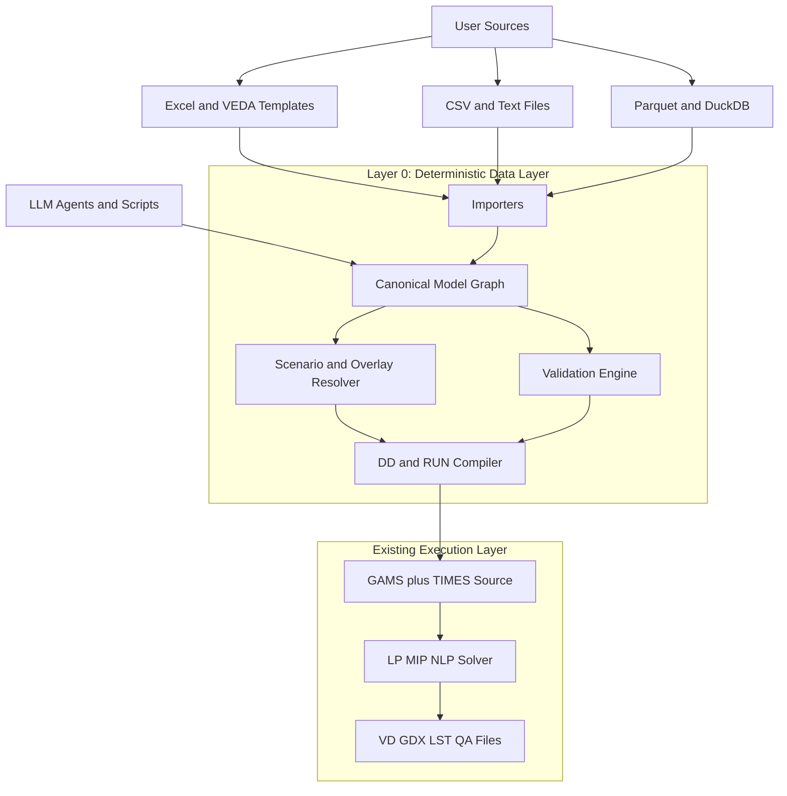

# Layer 0 Architecture Spec: Deterministic Data Layer for TIMES

This document defines the architecture for a replacement of the current VEDA-centric data layer for TIMES. The goal is not to replace the TIMES mathematics or GAMS execution engine first. The goal is to replace the fragile model authoring, data management, validation, and collaboration workflow that currently lives in Excel workbooks, VEDA databases, and ad hoc scripts.

The central design principle is:

> LLMs should accelerate authoring, debugging, migration, and explanation, but the source of truth must remain deterministic, typed, auditable, and reproducible.

## Problem Statement

Today, a TIMES model is operationally difficult to maintain because:

- data is authored across many Excel workbooks with VEDA-specific `~` tags;
- model structure and numeric payloads are mixed together in spreadsheets;
- validation happens late, often only during VEDA sync or GAMS compile/solve;
- large models hit database and post-processing limits, especially around Access/MDB size constraints;
- collaboration is poor because Excel files and local shell databases are not review-friendly or merge-friendly;
- modelers often create ad hoc Python, R, or GAMS utilities just to inspect or split data and results.

This is not primarily a mathematics problem. It is a data systems problem.

## Goals

The Layer 0 system must:

1. Provide a canonical model representation for TIMES data outside VEDA.
2. Support multiple source formats: Excel, CSV, Parquet, YAML/TOML, and existing DD files where useful.
3. Validate models before expensive GAMS runs.
4. Export deterministic DD/DDS files compatible with the existing TIMES/GAMS toolchain.
5. Scale from small prototype models to very large multi-region models such as EU-TIMES.
6. Make models diffable, reviewable, and collaborative using standard software engineering workflows.
7. Expose a clean programmatic interface so LLM agents and scripts can operate on the model safely.

## Non-Goals

At this stage, the system does not aim to:

- rewrite the TIMES equations;
- replace GAMS or solvers;
- recreate the entire VEDA user interface;
- solve results visualization fully;
- make free-form LLM generation the source of truth.

## Architectural Overview

The proposed system is a library-first platform named here as `times-data`.



## Core Design Decision

The canonical representation is not a spreadsheet and not a monolithic database. It is a **hybrid model graph**:

- **Structured text files** for model declarations, topology, configuration, and modular composition.
- **Columnar tabular storage** for large indexed parameter payloads.
- **Derived compiler artifacts** for DD/DDS and RUN generation.

This matches the real shape of TIMES models:

- some data is graph-like and relatively small, such as process declarations and commodity topology;
- some data is large and regular, such as annual parameter values by region, process, timeslice, and year.

## Canonical Model Graph

The in-memory source of truth is a typed `Model` object made of a few core domains:

- `ModelConfig`: regions, years, periods, timeslices, currencies, units, scenario composition;
- `Commodity`: name, type, unit, balance behavior, timeslice resolution;
- `Process`: topology, process type, group membership, process metadata;
- `ParameterTable`: indexed values mapped to formal TIMES parameter definitions;
- `ScenarioOverlay`: additive or overriding changes applied to a base model;
- `ValidationReport`: structural, semantic, and feasibility diagnostics;
- `CompilationArtifact`: DD, DDS, RUN, and auxiliary generated files.

The graph is authoritative. All editors, importers, validators, and agents work against it.

## Storage Model

### 1. Structural Files

Use YAML or TOML for human-authored structure:

- model identity and metadata;
- regions and timeslices;
- commodity declarations;
- process declarations and topology;
- scenario and overlay manifests;
- provenance metadata.

These files are small, reviewable, and easy for both humans and LLMs to modify.

### 2. Bulk Parameter Tables

Use Parquet as the default heavy payload format for large indexed data:

- `NCAP_COST`, `NCAP_AF`, `ACT_BND`, `FLO_FUNC`, and similar dense or wide tables;
- large time-series style data;
- region-year-process slices at EU-TIMES scale.

Use DuckDB locally as an execution and query layer over Parquet when needed:

- schema checks;
- joins across parameter tables;
- interactive diagnostics;
- fast subsetting during compilation and validation.

### 3. Derived Artifacts

Generate but never hand-edit:

- DD/DDS files;
- RUN/GEN files;
- manifest files for reproducibility;
- validation and build reports.

## Recommended Repository Layout

```text
model/
  config/
    model.yaml
    regions.yaml
    periods.yaml
    timeslices.yaml
  commodities/
    electricity.yaml
    co2.yaml
    gas.yaml
  processes/
    power/
      coal_pp.yaml
      solar_pv.yaml
      battery.yaml
    industry/
    transport/
  parameters/
    tables/
      ncap_cost.parquet
      ncap_af.parquet
      flo_func.parquet
  scenarios/
    baseline/
      manifest.yaml
    fit55/
      manifest.yaml
      policy-overrides.parquet
    netzero/
      manifest.yaml
  imports/
    veda-migration/
  build/
    dd/
    run/
    reports/
```

## Import Layer

The platform must ingest multiple real-world formats because TIMES data is already scattered across many storage forms.

### Required import paths

1. **VEDA Excel importer**
   - read SysSettings, B-Y, SubRES, scenario, demand, and trade templates;
   - parse VEDA tags and normalize them into the canonical model graph;
   - preserve source workbook provenance.

2. **CSV importer**
   - useful for public statistics and manually prepared tables;
   - support explicit mapping files from CSV columns to TIMES parameter indexes.

3. **Parquet importer**
   - first-class path for large model parameter payloads;
   - useful for national statistical pipelines and generated assumptions.

4. **Model-to-model merge**
   - import a technology library or regional package into another model.

### Import design rule

Every import path must end in the same internal representation and the same validator. This avoids one-off data handling logic.

## Parameter Schema System

Every TIMES parameter, set, and index should be represented as generated schema metadata derived from the reference material already ingested in this project.

A parameter definition must contain:

- exact parameter name;
- legal index signature;
- user/internal category;
- unit and range metadata where available;
- default interpolation/extrapolation rule;
- affected equations and variables;
- optional custom validation hooks.

This enables:

- autocompletion and typed authoring;
- deterministic validation;
- parameter-aware import mapping;
- agent assistance without free-form guessing.

## Validation Architecture

Validation must be layered so the fastest checks happen earliest.

### Level 1: Schema Validation

Runs on every edit or import.

Checks:

- valid parameter names;
- valid index sets and set members;
- value type and range checks;
- required fields for process and commodity declarations;
- duplicate or conflicting declarations.

### Level 2: Structural Validation

Runs before compile.

Checks:

- unresolved process or commodity references;
- RES connectivity issues;
- commodities that are never produced or never consumed;
- invalid process topology;
- scenario overlay conflicts;
- suspicious or missing timeslice mappings;
- invalid or ambiguous interpolation coverage.

### Level 3: Feasibility Pre-Checks

Runs before expensive solves.

Checks:

- simple demand adequacy against available capacity;
- obvious resource insufficiency;
- impossible policy targets under current build constraints;
- mutually conflicting hard bounds;
- suspiciously empty technology pathways in a region-year slice.

This level is heuristic, not mathematically complete, but it should catch the most common avoidable infeasibilities early.

## Compiler Boundary

The compiler is the hard deterministic edge between the new data layer and the existing TIMES engine.

Responsibilities:

- resolve model composition and scenario overlays;
- materialize inherited/default values;
- apply interpolation/extrapolation;
- normalize internal representations into TIMES-legal indexed tables;
- emit DD/DDS text files and the top-level RUN file.

Design constraint:

> Given the same canonical model graph and the same compiler version, the output DD files must be identical and reproducible.

This makes the compiler testable and suitable for CI.

## Large Model Strategy

Large models such as JRC-EU-TIMES should not be treated as a single editable workbook or a single giant in-memory artifact for all workflows.

### 1. Modular composition

Large models should be organized by:

- region modules;
- sector modules;
- shared technology libraries;
- trade and interconnection modules;
- scenario overlays.

### 2. Selective loading and partial validation

The system should support:

- validating only one region or sector subtree;
- building only one scenario overlay;
- generating diagnostic subsets before full compilation.

### 3. Columnar bulk storage

Parquet plus DuckDB is the right default for large parameter tables because:

- it avoids spreadsheet size limits;
- it supports indexed queries;
- it handles millions of rows efficiently;
- it is friendly to Python, R, and analytics tooling.

### 4. Results storage outside Access

Forum evidence shows the existing results workflow breaks on large outputs because VEDA-BE relies on Access/MDB limits around 2 GB. Large SPINES and stochastic runs require manual VD splitting or ad hoc scripts just to inspect results.

Therefore, results should eventually be stored in:

- Parquet for durable artifact storage;
- DuckDB for local analytics;
- optional Postgres or cloud warehouse for shared hosted analysis.

## Collaboration Model

The system should make a TIMES model behave like a software project.

### Collaboration principles

- the canonical representation is file-based and git-native;
- every change is diffable and reviewable;
- validation runs in CI before merge;
- scenario overlays are isolated from shared core libraries;
- provenance is preserved for assumptions and imports.

### Required collaboration features

- semantic diffing: what changed in the model, not just which lines changed;
- validation reports in pull requests;
- scenario overlay diffing;
- reusable technology and region packages;
- branch-based experimentation with reproducible builds.

This is the main operational advantage over Excel and Access-based workflows.

## Agentic Layer

LLMs sit above the deterministic layer, not inside it.

### Good uses for agents

- converting messy source data into structured imports;
- drafting process or commodity definitions;
- proposing parameter mappings from external datasets;
- diagnosing validation failures in plain English;
- tracing likely causes of infeasibility using validation outputs and logs;
- searching the wiki and forum-derived knowledge base;
- generating migration patches from VEDA templates to canonical model files.

### Bad uses for agents

- inventing parameter structures without schema constraints;
- directly editing compiled DD files as the source of truth;
- bypassing validation;
- making silent changes to model semantics.

### Agent workflow

1. Human asks for a change.
2. Agent drafts structured edits.
3. Deterministic validator runs.
4. Human reviews.
5. Compiler exports.
6. GAMS solves.
7. Agent helps interpret results and diagnostics.

## Editing Existing Models

Editing existing VEDA-era models becomes feasible if migration is incremental.

### Migration path

1. Import current VEDA templates into the canonical model graph.
2. Preserve names, regions, scenario structure, and topology as-is.
3. Export DD files and compare against current runs.
4. Begin editing in the new canonical representation.
5. Only later deprecate Excel for portions of the model that are stable.

This allows immediate value without requiring a complete rewrite of large institutional models.

## MVP Definition

The MVP should not be a web app. It should be a library and CLI that can already replace the most painful parts of VEDA's data layer.

### MVP capabilities

1. generated parameter and set schema from reference data;
2. canonical in-memory model graph;
3. YAML/TOML model config and structure files;
4. Parquet-backed parameter tables;
5. VEDA template importer for a constrained subset;
6. schema and structural validation;
7. DD/DDS exporter;
8. CLI commands for validate, import, export, and diff.

### CLI shape

```bash
times-data import-veda ./VEDA_Models/EU_TIMES -o ./model
times-data validate ./model
times-data check ./model
times-data export-dd ./model -o ./build/dd
times-data diff ./model ./model-alt
```

## Rollout Plan

### Phase 1

Build the deterministic core and prove it on small demo models.

### Phase 2

Prove import/export equivalence on real existing models:

- DemoS models;
- one mid-size national model;
- one large multi-region model slice.

### Phase 3

Add collaboration workflows, CI validation, and semantic diff tools.

### Phase 4

Add agentic authoring and debugging assistants powered by the wiki and validated against the deterministic core.

## Major Risks

1. **VEDA import complexity** -- parsing every variant of existing workbook practice will take time.
2. **Exact DD equivalence** -- some edge cases may rely on undocumented VEDA behavior.
3. **Large model memory pressure** -- careless in-memory representations will fail at EU-TIMES scale.
4. **Scope creep** -- trying to replace VEDA FE, BE, and GAMS all at once would be a mistake.

## Recommendation

Build Layer 0 first as a strict deterministic compiler-and-validation platform for TIMES data. Treat LLMs as expert copilots operating against that platform, not as the platform itself.

If successful, this becomes the foundation for:

- a true VEDA replacement;
- collaborative model development;
- early infeasibility diagnostics;
- reproducible scenario engineering;
- and eventually an LLM-native modeling experience that is still trustworthy at institutional scale.
